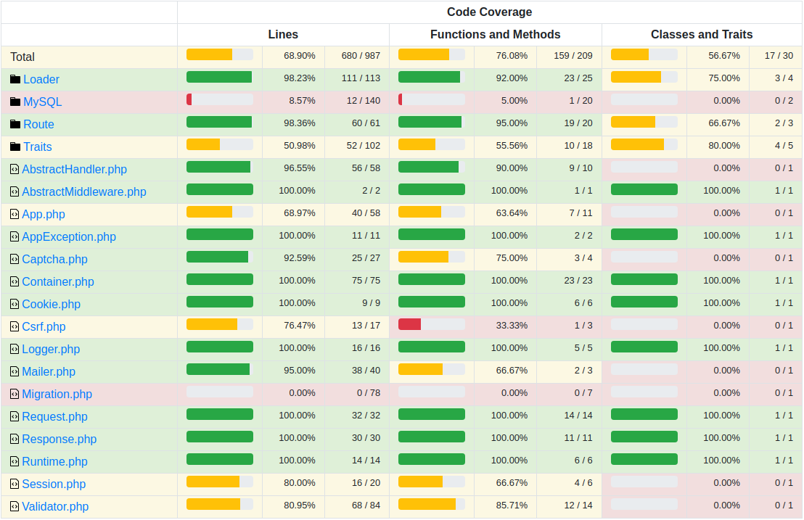

Create for fun!

[Example project](https://github.com/WalkWeb/DW-Framework)

Install:

`composer require walkweb/dw-framework-core`

Configuration:

`cp .env.example .env`

And set your parameters in `.env` file

## Test coverage

